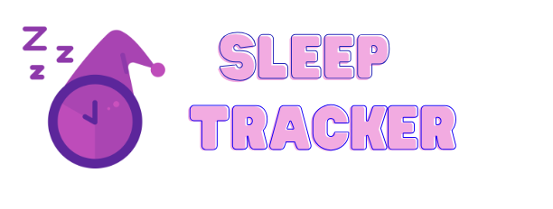
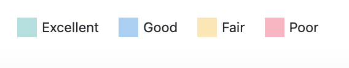

---
permalink: /tracking/
--- 

<html>

<body>

        

        <form id="exerciseForm">
            <label for="exerciseType">Exercise Type:</label>
            <input type="text" id="exerciseType" name="exerciseType" placeholder="Enter exercise type" required>
            <label for="duration">Duration (in minutes):</label>
            <input type="number" id="duration" name="duration" placeholder="Enter duration" required>
            <label for="exerciseDate">Date of Exercise:</label>
            <input type="date" id="exerciseDate" name="exerciseDate" required>
            <input type="submit" value="Submit">
        </form>
    

    
    <iframe src="{{site.baseurl}}/exercisegraph" width="400" height="100" frameborder="0"></iframe>
</body>
</html>

 

<meta charset="UTF-8">
<title>Sleep Tracker</title>

 

    <form id="sleepForm">
        <label for="sleepHours">Hours of Sleep:</label>
        <input type="number" id="sleepHours" name="sleepHours" placeholder="Enter hours of sleep" required>
        <label for="quality">Quality of Sleep:</label>
        <select id="quality" name="quality" required>
            <option value="" disabled selected>Select quality</option>
            <option value="excellent">Excellent</option>
            <option value="good">Good</option>
            <option value="fair">Fair</option>
            <option value="poor">Poor</option>
        </select>
        <label for="sleepDate">Date:</label>
        <input type="date" id="sleepDate" name="sleepDate" required>
        <input type="submit" value="Submit">
    </form>

 <iframe src="{{site.baseurl}}/sleepgraph" width="800" height="600" frameborder="0"></iframe>
    
<html>

